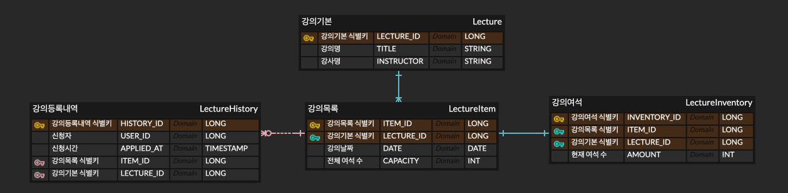
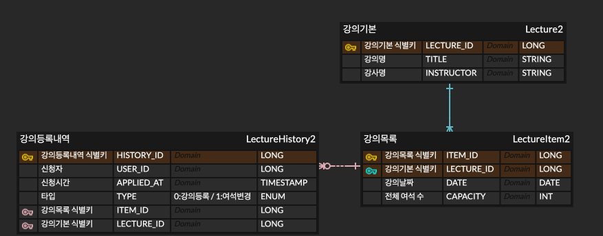

# 🚢 HHPLUS BE06
WEEK #2 특강 신청 서비스
## ✅ 구현 목록

---

### **`Default`**

- [x] 아키텍처 준수를 위한 애플리케이션 패키지 설계
- [x] 특강 도메인 테이블 설계 및 목록/신청 등 기본 기능 구현
- [x] 각 기능에 대한 **단위 테스트** 작성

### **`STEP 3`**

- [x] 설계한 테이블에 대한 **ERD** 및 이유를 설명하는 **README** 작성
- [x] 선착순 30명 이후의 신청자의 경우 실패하도록 개선
- [x] 동시에 동일한 특강에 대해 40명이 신청했을 때, 30명만 성공하는 것을 검증하는 **통합 테스트** 작성

### **`STEP 4`**

- [X] 같은 사용자가 동일한 특강에 대해 신청 성공하지 못하도록 개선
- [X] 동일한 유저 정보로 같은 특강을 5번 신청했을 때, 1번만 성공하는 것을 검증하는 **통합 테스트** 작성

## ERD

---

- 과제 명세 안에선 유저 테이블이 필요하지 않다 판단해 생성하지 않고 [강의등록내역] 테이블로 반정규화했습니다.
- 특강 신청 시 동시성 제어를 위해 비관적 락을 걸 경우 강의 기본 / 목록 정보를 수정이 영향이 가지 않게 [강의여석] 테이블로 정규화 했습니다.
- 이후 테이블 칼럼 값을 update하거나 delete 때를 생각하여 식별/비식별 관계로 나누었습니다.
  - [강의목록], [강의여석] 테이블은 각각 [강의기본], [강의목록] 테이블에 종속적으로 설정했습니다.
  - [강의등록내역] 테이블의 경우 [강의여석] 테이블의 값이 변하거나 삭제되더라도 값을 유지해야하기에 비식별관계로 설정했습니다.
- ⚠️ [강의목록 테이블]의 [전체 여석 수] 칼럼을 변경 시 [강의여석 테이블]의 [현재 여석 수] 칼럼의 값을 변경해줘야 하나 강의 정보값 자체를 변경하는 것은 명세에 있지 않아 이부분 로직은 우선순위를 뒤로 돌렸습니다.
  
- ⚠️ 우선순위를 뒤로 물렸기에 [강의등록 내역 테이블]에 [현재 여석 변경 타입] 칼럼은 제외 했습니다.
  [변경 여석 수] 칼럼 또한 우선은 제외했습니다.
- 위 사항들을 만족하려면 아래와 같은 ERD로 구성될 것입니다.

